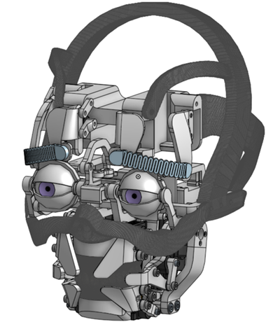

([简体中文](./README_zh.md)|English)
# Intelligent Voice Interactive Robot with Facial Expressions



This project is an intelligent voice interactive robot based on ESP32, Arduino (or similar microcontroller), a Python server, and various AI services. It can communicate with users through voice and interact with facial expressions (controlled by servos) and an OLED display.

**License:** [MIT License](LICENSE)

## Table of Contents

- [Project Overview](#project-overview)
- [Features](#features)
- [System Architecture](#system-architecture)
- [Hardware Requirements](#hardware-requirements)
- [Software Dependencies](#software-dependencies)
- [Project Structure](#project-structure)
- [Installation and Configuration](#installation-and-configuration)
  - [Hardware Connection](#hardware-connection)
  - [ESP32 (Voice Interaction Module)](#esp32-voice-interaction-module)
  - [Arduino (Servo Control Module)](#arduino-servo-control-module)
  - [Server-side](#server-side)
- [Running the Project](#running-the-project)
- [Usage](#usage)
- [Configuration File Details](#configuration-file-details)
  - [`Voice Interaction/src/config.h`](#voice-interactionsrcconfigh)
  - [`Server/config.json`](#serverconfigjson)
- [Facial Expression Control](#facial-expression-control)
- [Troubleshooting](#troubleshooting)
- [TODO](#TODO)
- [Contribution Guidelines](#contribution-guidelines)
- [Acknowledgements](#acknowledgements)

## Project Overview

The robot captures the user's voice through a microphone and sends it to a backend server for Automatic Speech Recognition (ASR), Natural Language Understanding (NLU/LLM), and Text-to-Speech (TTS). After processing, the server sends the generated voice reply and corresponding expression commands to the ESP32 for playback and to the Arduino for displaying expressions, respectively. The ESP32 also controls the OLED display and RGB LED status light.

## Features

*   **Voice Interaction**:
    *   Audio input via INMP441 microphone.
    *   Audio output using MAX98357A audio amplifier.
    *   On-board energy-based Voice Activity Detection (VAD).
*   **Facial Expressions**:
    *   Achieves various facial expressions (neutral, happy, sad, surprised) through 20 SG90 servos (mounted on a 3D-printed skull and controlled by two PCA9685 driver boards) simulating eyebrows, eyes, and mouth.
    *   Supports blinking and mouth animations during speech.
*   **AI Processing**:
    *   **Speech Recognition (ASR)**: Uses the SenseVoice model for multilingual speech recognition.
    *   **Natural Language Understanding and Generation (LLM)**: Uses DeepSeek API for dialogue management and response generation.
    *   **Text-to-Speech (TTS)**: Uses GPT-SoVITS for speech synthesis.
*   **User Interface and Status Indication**:
    *   OLED display (SSD1306) shows system status and interaction text.
    *   RGB NeoPixel LED indicates the robot's current status (e.g., listening, processing, playing).
*   **Control and Communication**:
    *   ESP32 communicates with the server via WiFi (TCP/IP).
    *   The server communicates with Arduino via serial to control expressions.
    *   FreeRTOS for multitasking on ESP32.
    *   Button controls (volume adjustment, start/stop interaction).
*   **Modular Design**:
    *   Independent ESP32 voice interaction module.
    *   Independent Arduino servo control module.
    *   Python backend server integrating various AI services.

## System Architecture

```
+---------------------+     WiFi (TCP/IP)     +-----------------------+     Serial     +---------------------+
| ESP32               |<--------------------->| Python Server         |<--------------->| Arduino (Servo Ctrl)|
| (Voice Interaction) |                       | (ASR, LLM, TTS)       |                | (PCA9685 x2, SG90x20)|
| - INMP441 Mic       |                       | - SenseVoice (ASR)    |                +---------------------+
| - MAX98357A Amp     |                       | - GPT-SoVITS (TTS)    |
| - OLED Display      |                       | - DeepSeek API (LLM)  |
| - NeoPixel LED      |                       | - Arduino Comms       |
| - Buttons           |                       +-----------------------+
| - VAD, I2S          |                              |
+---------------------+                              | HTTP/Socket
                                                     |
                        +----------------------------+----------------------------+
                        |                                                         |
            +-----------------------+                             +-----------------------+
            | SenseVoice Server     |                             | GPT-SoVITS API Server |
            | (conda env, python)   |                             | (go-api.bat)          |
            +-----------------------+                             +-----------------------+
```

1.  **ESP32 (Voice Interaction Module)**:
    *   Captures user's voice, performs initial VAD processing.
    *   Sends audio data to the Python server via WiFi.
    *   Receives audio data returned by the server and plays it.
    *   Receives text data returned by the server and displays it on the OLED.
    *   Controls RGB LED based on server commands or internal status.
    *   Interacts with the user via buttons.
2.  **Python Server**:
    *   Receives audio data sent by ESP32.
    *   Calls **SenseVoice Server** for speech recognition.
    *   Sends the recognized text to **DeepSeek API** to get a reply and emotion.
    *   Sends the text generated by LLM and the specified language to **GPT-SoVITS API Server** for speech synthesis.
    *   Sends the synthesized speech (PCM format) and reply text back to ESP32.
    *   Sends commands to **Arduino** via serial to control facial expressions based on the emotion returned by LLM.
3.  **Arduino (Servo Control Module)**:
    *   Receives serial commands from the Python server.
    *   Controls 20 SG90 servos via two PCA9685 driver boards to achieve preset facial expressions, blinking, and speaking animations.
4.  **SenseVoice Server**:
    *   An independent Python process running the SenseVoice model, providing ASR service.
5.  **GPT-SoVITS API Server**:
    *   An independent process (started via `go-api.bat`), providing TTS service.

## Hardware Requirements

*   **Voice Interaction Module (ESP32)**:
    *   ESP32 development board (e.g., ESP32-WROOM-32)
    *   INMP441 I2S microphone module
    *   MAX98357A I2S audio amplifier module + Speaker
    *   OLED display (SSD1306, 128x32, I2C)
    *   NeoPixel RGB LED (e.g., WS2812B)
    *   3 momentary buttons (for volume up, volume down, start/stop)
    *   Connecting wires, breadboard, resistors, etc.
*   **Servo Control Module (Arduino)**:
    *   Arduino Uno/Nano or similar microcontroller (can also be another ESP32)
    *   2 x PCA9685 16-channel PWM servo driver boards
    *   20 x SG90 servos (or similar model)
    *   3D-printed skull structure (for servo mounting, design references available on open-source platforms like [Onshape](https://www.onshape.com/) or customizable)  
    *   External power supply (for servos, e.g., 5V 3A+)
    *   Connecting wires
*   **Server**:
    *   A PC or server (Windows/Linux/macOS)
    *   NVIDIA GPU (recommended, for SenseVoice and GPT-SoVITS acceleration)
*   **Other**:
    *   USB cables
    *   WiFi router

## Software Dependencies

*   **ESP32 (Voice Interaction Module)**:
    *   Arduino IDE or PlatformIO
    *   ESP32 Board Support Package
    *   Arduino libraries:
        *   `WiFi.h`
        *   `driver/i2s.h` (ESP-IDF component)
        *   `Adafruit_NeoPixel.h`
        *   `U8g2lib.h`
        *   FreeRTOS (usually provided with ESP32 core)
*   **Arduino (Servo Control Module)**:
    *   Arduino IDE or PlatformIO
    *   Arduino libraries:
        *   `Wire.h`
        *   `Adafruit_PWMServoDriver.h`
*   **Server-side (Python)**:
    *   Python 3.8+
    *   Conda (recommended, for managing SenseVoice environment)
    *   **SenseVoice**:
        *   Install dependencies according to `SenseVoice Instruction.md` (usually in a conda environment).
        *   SenseVoiceSmall model (download from ModelScope or Hugging Face).
    *   **GPT-SoVITS**:
        *   Install and configure according to its official repository instructions.
        *   Trained GPT and SoVITS models.
        *   `go-api.bat` dependencies (usually Go environment).
    *   **Python Dependencies (recommended to use `requirements.txt`)**:
        *   `numpy`
        *   `soundfile`
        *   `openai` (for DeepSeek API)
        *   `requests`
        *   `pyserial`
        *   `funasr` (SenseVoice dependency)
        *   `torch` (SenseVoice and possible GPT-SoVITS dependency)
    *   **DeepSeek API**:
        *   Requires a valid API key.
    *   **ffmpeg**:
        *   Needs to be installed and added to the system PATH (for audio format conversion).

## Project Structure

```
Intelligent-Voice-Interactive-Robots-with-Facial-Expressions/
├── Voice Interaction/      # ESP32 Voice Interaction Module Code
│   └── src/
│       ├── main.cpp
│       └── config.h        # ESP32 WiFi and Server Configuration
├── Servo Control/          # Arduino Servo Control Module Code
│   └── src/
│       └── main.cpp
├── Server/                 # Python Backend Server Code
│   ├── server.py           # Main server logic (LLM, TTS, Arduino communication)
│   ├── sensevoice.py       # SenseVoice ASR service script
│   └── config.json         # Server configuration (API keys, ports, etc.)
├── data/                   # Data files
│   ├── voice.wav           # Temporary storage for recorded audio
│   └── ref/                # TTS reference audio folder
│       └── ayaka.wav       # Example reference audio (or other)
├── SenseVoice/             # SenseVoice model related (e.g., model.py)
|   ├── README.md           # SenseVoice usage instructions
├── GPT-SoVITS/             # GPT-SoVITS model related (e.g., go-api.bat)
|   ├── README.md           # GPT-SoVITS usage instructions
│   └── go-api.bat          # GPT-SoVITS model loading script (example path)
├── servoControlDisplay.py  # For servo testing
├── work.bat                # Windows batch script to start server components
└── README.md               # This file
```

## Installation and Configuration

### Hardware Connection

1. **ESP32 Module**:
   *   Connect INMP441, MAX98357A, OLED, NeoPixel LED, and buttons according to the pin definitions in `Voice Interaction/src/main.cpp`.
   *   Ensure I2S pins are correctly connected.

2. **Arduino Module**:

   * Prepare the 3D-printed skull structure.
   * Install SG90 servos into the designated positions on the 3D-printed skull.

   *   Connect the SDA, SCL pins of both PCA9685 boards to the Arduino's I2C pins (usually A4, A5).
   *   Set different I2C addresses for the PCA9685 boards (0x40, 0x41).
   *   Connect SG90 servos to the channels of the PCA9685 boards.
   *   Provide a stable external power supply for the servos and PCA9685 boards.
   *   Connect Arduino to the PC running the server via USB.

3. **Power Supply**: Ensure all modules have a stable and sufficient power supply, especially the servo section.

### ESP32 (Voice Interaction Module)

1.  **IDE Setup**:
    *   Install Arduino IDE or PlatformIO.
    *   In Arduino IDE, install ESP32 board support via Board Manager.
    *   Install `Adafruit NeoPixel` and `U8g2` libraries via Library Manager.
2.  **Configuration**:
    *   Open `Voice Interaction/src/config.h`.
    *   Modify `WIFI_SSID` and `WIFI_PASSWORD` with your WiFi credentials.
    *   Modify `SERVER_HOST` to the IP address of the PC running the Python server. `SERVER_PORT` defaults to 5000, corresponding to `esp32.port` in `Server/config.json`.
    *   Adjust VAD parameters as needed.
3.  **Upload Code**:
    *   Select the correct ESP32 board model and port.
    *   Compile and upload `Voice Interaction/src/main.cpp` to ESP32.

### Arduino (Servo Control Module)

1.  **IDE Setup**:
    *   Install Arduino IDE or PlatformIO.
    *   Install `Adafruit PWM Servo Driver Library` via Library Manager.
2.  **Upload Code**:
    *   Select the correct Arduino board model and port.
    *   Compile and upload `Servo Control/src/main.cpp` to Arduino.

### Server-side

1.  **Clone Repository**:
    ```bash
    git clone <your-repository-url>
    cd Intelligent-Voice-Interactive-Robots-with-Facial-Expressions
    ```
2.  **SenseVoice Environment and Model**:
    *   Create a conda environment:
        ```bash
        conda create -n sensevoice python=3.8  # or higher
        conda activate sensevoice
        ```
    *   Install SenseVoice and its dependencies according to `SenseVoice/README.md`. This usually includes `funasr` and `torch`.
        ```bash
        pip install funasr -i https://pypi.tuna.tsinghua.edu.cn/simple
        pip install torch torchvision torchaudio --index-url https://download.pytorch.org/whl/cu118 # Choose according to your CUDA version
        # Other potentially required dependencies
        ```
    *   Download the SenseVoiceSmall model (e.g., `iic/SenseVoiceSmall`) and place it in an appropriate location. The `model_dir` in the `sensevoice.py` script points to this model.
    *   Ensure the `remote_code` path in `sensevoice.py` correctly points to `SenseVoice/model.py` (if using local model code).
3.  **GPT-SoVITS Environment and Model**:
    *   Install and configure according to the `GPT-SoVITS/README.md` instructions.
    *   Place your trained GPT and SoVITS models in their required paths.
    *   In `work.bat`, modify `YOUR_GPT_SOVITS_MODEL_PATH` to your GPT-SoVITS project path.
4.  **Python Dependencies (Main Environment)**:
    *   (Optional) It is recommended to also create a virtual environment for the main server logic.
    *   Install necessary Python packages:
        ```bash
        pip install numpy soundfile openai requests pyserial
        ```
5.  **ffmpeg**:
    *   Download ffmpeg and add its executable path to the system environment variable `PATH`.
6.  **Configure `Server/config.json`**:
    *   `deepseek_client.api_key`: Fill in your DeepSeek API key.
    *   `sensevoice_server`: Usually keep the default (`localhost`, `12345`), ensure it matches the binding address in `sensevoice.py`.
    *   `esp32.host`: Fill in the IP address the server listens on for ESP32 connections (usually the server's local IP address, `0.0.0.0` means listen on all interfaces). `esp32.port` must match `SERVER_PORT` in ESP32's `config.h`.
    *   `arduino.port`: Fill in the COM port Arduino is connected to on the PC (e.g., `COM3` on Windows, `/dev/ttyUSB0` on Linux).
    *   `arduino.baudrate`: Keep `9600` (consistent with Arduino code).
    *   `tts_service`: Configure default reference voice, prompt text, and language for GPT-SoVITS. Ensure the `.wav` file corresponding to `ref_voice_name` exists in the `data/ref/` directory.

## Running the Project

1.  **Start GPT-SoVITS API Service**:
    *   Open a new command line window.
    *   Navigate to your GPT-SoVITS model path (i.e., `YOUR_GPT_SOVITS_MODEL_PATH` in `work.bat`).
    *   Run `go-api.bat` (or other startup script).
    *   Ensure the API service starts successfully at `http://127.0.0.1:9880` (or your configured address).
2.  **Start SenseVoice ASR Service**:
    *   Open a new command line window.
    *   Activate SenseVoice's conda environment: `conda activate sensevoice`
    *   Navigate to the `Server/` directory.
    *   Run `python sensevoice.py`.
    *   Ensure the service starts successfully on the `sensevoice_server.host_server` and `port_server` configured in `config.json` (default `0.0.0.0:12345`) and displays "Waiting for connection...".
3.  **Start Main Server**:
    *   Open a new command line window.
    *   (Activate virtual environment if used)
    *   Navigate to the `Server/` directory.
    *   Run `python server.py`.
    *   The server will attempt to connect to the SenseVoice service and wait for ESP32 and Arduino connections.
4.  **Using `work.bat` (Windows)**:
    *   Before running `work.bat`, ensure `YOUR_GPT_SOVITS_MODEL_PATH` is correctly configured.
    *   Double-click `work.bat` to attempt to start the above three services in order. Each service will run in its own command prompt window.
5.  **Start Hardware**:
    *   Power on the ESP32 and Arduino modules.
    *   ESP32 will attempt to connect to WiFi and the server. The OLED screen and serial monitor will display the connection status.
    *   The console of the main server `server.py` will display the connection status of ESP32 and Arduino.

## Usage

1.  Wait for all services and hardware modules to start and connect successfully.
2.  The OLED screen on ESP32 will display initial information, and the RGB LED may show a standby color (e.g., orange).
3.  Press the "Start" button on ESP32.
4.  The LED turns red (ready to record).
5.  When you start speaking, if VAD detects speech:
    *   The LED turns green (listening/recording).
    *   OLED displays "Listening to your voice".
    *   ESP32 streams audio to the server.
6.  After you finish speaking, ESP32 will send a stop signal.
7.  The server processes the audio (ASR -> LLM -> TTS).
    *   OLED displays "Processing..." or similar processing information.
    *   LED blinks blue (waiting for server response).
    *   Arduino will adjust facial expression based on the emotion recommended by LLM.
8.  The server sends the synthesized voice and text reply back to ESP32.
9.  ESP32 plays the voice reply.
    *   OLED displays the reply text (may scroll).
    *   LED turns purple (playing).
    *   Arduino will perform speaking animation.
10. After playback is complete, the LED turns red again, ready for the next interaction, or returns to standby state after a timeout.
11. Volume up/down buttons can be used to adjust the playback volume on ESP32.
12. Pressing the "Start" button again can stop the current session midway or wake up from standby.

## Configuration File Details

### `Voice Interaction/src/config.h`

*   `WIFI_SSID`: Your WiFi network name.
*   `WIFI_PASSWORD`: Your WiFi password.
*   `SERVER_HOST`: IP address of the PC running the Python main server.
*   `SERVER_PORT`: Port number on which the Python main server listens for ESP32 connections (should match `esp32.port` in `Server/config.json`).
*   `MAX_VAD_INTERVAL`: Maximum silence detection interval (ms).
*   `MAX_ACTIVATE_INTERVAL`: Maximum duration for a single voice activation (ms).
*   `MAX_REST_LIMIT`: Maximum waiting time before entering sleep mode without voice activation (ms).
*   `VAD_ENERGY_THRESHOLD`: VAD energy threshold.

### `Server/config.json`

*   `general.history_maxlen`: Maximum number of turns in LLM conversation history.
*   `deepseek_client.api_key`: Your DeepSeek API key.
*   `sensevoice_server`:
    *   `host_socket`: Hostname used by `server.py` to connect to the `sensevoice.py` service (usually `localhost`).
    *   `port_socket`: Port number used by `server.py` to connect to the `sensevoice.py` service.
    *   `host_server`: Host address `sensevoice.py` service binds to (`0.0.0.0` to listen on all interfaces).
    *   `port_server`: Port number `sensevoice.py` service binds to.
*   `esp32`:
    *   `host`: Host address `server.py` listens on for ESP32 connections (`0.0.0.0` to listen on all interfaces).
    *   `port`: Port number `server.py` listens on for ESP32 connections.
*   `arduino`:
    *   `port`: Serial port Arduino is connected to (e.g., "COM3", "/dev/ttyUSB0").
    *   `baudrate`: Serial baud rate (should match Arduino code, default 9600).
*   `tts_service`: GPT-SoVITS default parameters
    *   `ref_voice_name`: Filename of the reference voice (without extension, e.g., "ayaka"), the corresponding `.wav` file should be in the `data/ref/` directory.
    *   `ref_prompt_text`: Prompt text for the reference voice.
    *   `ref_prompt_language`: Language of the reference voice prompt text.

## Facial Expression Control

Servo control code is located in `Servo Control/src/main.cpp`. It defines the following expressions and actions:

*   **Expressions**:
    *   `netural()`: Neutral expression
    *   `happiness()`: Happy expression
    *   `sadness()`: Sad expression
    *   `surprise()`: Surprised expression
*   **Actions**:
    *   `blink()`: Blink action (will restore eyelids based on current expression state)
    *   Speaking animation: Controlled in the `loop()` function via commands `0x21` (start speaking) and `0x22` (stop speaking) for the mouth servo (PCA2, Servo 14).

The server sends commands to Arduino via serial to trigger these expressions and actions. The command format is defined in `Server/server.py` and `Servo Control/src/main.cpp`:

*   `0x02` + `x_angle` + `y_angle`: Control eyeball movement (currently not fully utilized for fine control in server code, set globally by expression functions).
*   `0x10`: Neutral expression
*   `0x11`: Happy expression
*   `0x12`: Sad/Angry expression
*   `0x13`: Scared/Surprised expression
*   `0x21`: Start speaking animation
*   `0x22`: Stop speaking animation

## Troubleshooting

*   **ESP32 cannot connect to WiFi**: Check if WiFi credentials in `config.h` are correct and WiFi signal is good.
*   **ESP32 cannot connect to server**:
    *   Ensure server IP address is correctly configured in `config.h`.
    *   Ensure Python main server (`server.py`) is running and listening on the correct IP and port.
    *   Check firewall settings to allow ESP32 port communication.
*   **`sensevoice.py` fails to start or load model**:
    *   Ensure conda environment is activated.
    *   Check if model path and `remote_code` path are correct.
    *   Ensure all SenseVoice dependencies are installed, especially PyTorch and CUDA (if using GPU).
*   **GPT-SoVITS API not working**:
    *   Check if `go-api.bat` started successfully without errors.
    *   Ensure model paths are configured correctly.
*   **`server.py` cannot connect to SenseVoice or Arduino**:
    *   Ensure `sensevoice.py` is running.
    *   Ensure Arduino is connected to PC and the COM port in `config.json` is correct.
    *   Check if drivers are correctly installed (especially serial port drivers on Windows).
*   **No sound output/input**:
    *   Check hardware connections of microphone and speaker.
    *   Check I2S pin configuration.
    *   Add serial debug messages in ESP32 code to see if audio data is being read and written correctly.
*   **Servos not working or behaving erratically**:
    *   Check if the external power supply for servos is sufficient and stable.
    *   Check PCA9685 I2C address and connections.
    *   Check servo connections to PCA9685.
    *   Test individual servos to isolate problems.
*   **LLM reply format error**:
    *   The `system_prompt` in `server.py` has strict requirements for LLM output format. If LLM fails to adhere strictly, JSON parsing will fail. Try adjusting the prompt or adding stronger post-processing logic.

## TODO

*   **Enhanced Emotional Expression**:
    *   Implement more nuanced facial expressions beyond the basic set.
    *   Dynamically adjust expression intensity based on LLM emotion scores.
    *   Add subtle idle animations (e.g., occasional blinks, slight head movements).
*   **Intelligent Voice Control**:
    *   Implement a voice command system (supporting expression control, weather queries, etc.).
    *   Develop IoT device integration interfaces (enabling voice control of lights, air conditioners, and other smart devices).
    *   Integrate real-time information query capabilities (weather, news, schedule reminders, etc.).
    *   Create a voice command shortcut library (supporting user-defined quick commands).
*   **Improved Voice Interaction**:
    *   Implement barge-in capability (allow user to interrupt the robot's speech).
    *   Explore local ASR and TTS options to reduce latency and reliance on cloud services.
    *   Add support for more languages in TTS if GPT-SoVITS allows.
*   **Voice Perception Capabilities**:
    *   Develop environmental sound recognition (e.g., doorbells, alarms, and other IoT device sounds).
    *   Implement audio scene analysis-based environmental awareness.
    *   Add customizable voice wake-word functionality.
*   **Vision Capabilities**:
    *   Integrate a camera for face detection/recognition.
    *   Implement object recognition to allow interaction with the environment.
    *   Use visual cues to understand user engagement or detect specific gestures.
*   **Mobility**:
    *   Add a mobile base to allow the robot to move.
*   **User Customization**:
    *   Allow users to easily define new voice commands or interaction flows.
    *   Provide a simpler interface for customizing TTS voice or LLM personality.
*   **System Robustness and Usability**:
    *   Improve error handling and recovery mechanisms across all modules.
    *   Develop a more user-friendly setup and configuration process.
    *   Add more comprehensive logging for easier debugging.
    *   Optimize power consumption, especially for battery-powered operation.
*   **Advanced LLM Integration**:
    *   Explore using LLMs for more complex task planning or reasoning.
    *   Fine-tune an LLM specifically for this robot's persona and tasks.
*   **Code and Documentation**:
    *   Refactor code for better modularity and maintainability.
    *   Add more detailed inline comments and expand documentation.
    *   Create unit tests for server-side Python components.
*   **Hardware Upgrades**:
    *   Explore using more precise or quieter servos.
    *   Investigate higher-quality microphone arrays for better sound capture.
    *   Consider a more powerful main MCU if ESP32 limitations are reached.
*   **Web Interface**:
    *   Develop a web interface for configuration, status monitoring, and manual control.

## Contribution Guidelines

Contributions to this project are welcome! Please follow these steps:

1.  Fork this repository.
2.  Create a new branch (`git checkout -b feature/AmazingFeature`).
3.  Commit your changes (`git commit -m 'Add some AmazingFeature'`).
4.  Push your branch to remote (`git push origin feature/AmazingFeature`).
5.  Open a Pull Request.

## Acknowledgements

*   **FunASR/SenseVoice Team**: For providing excellent speech recognition models.
*   **GPT-SoVITS Community**: For providing powerful speech synthesis tools.
*   **DeepSeek AI**: For providing language model API.
*   **Adafruit**: For providing driver libraries for PCA9685, NeoPixel, etc.
*   **U8g2 Library Author**: For providing a powerful OLED display library.
*   All related open-source projects and communities.


---

**Disclaimer**: This project uses third-party APIs and services. Please comply with the terms of use of each service provider. Keep sensitive information such as API keys secure and do not commit them directly to public code repositories.