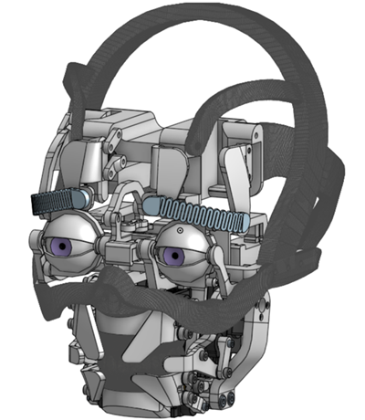

「简体中文」|「[English](./README.md)」
# 智能语音交互面部表情机器人



本项目是一个基于ESP32、Arduino（或类似微控制器）、Python服务器和多种AI服务的智能语音交互机器人，能够通过语音与用户交流，并配合面部表情（通过舵机控制）和OLED显示屏进行互动。

**许可证:** [MIT License](LICENSE)

## 目录

- [项目概述](#项目概述)
- [功能特性](#功能特性)
- [系统架构](#系统架构)
- [硬件要求](#硬件要求)
- [软件依赖](#软件依赖)
- [项目结构](#项目结构)
- [安装与配置](#安装与配置)
  - [硬件连接](#硬件连接)
  - [ESP32 (语音交互模块)](#esp32-语音交互模块)
  - [Arduino (舵机控制模块)](#arduino-舵机控制模块)
  - [服务器端](#服务器端)
- [运行项目](#运行项目)
- [使用方法](#使用方法)
- [配置文件详解](#配置文件详解)
  - [`Voice Interaction/src/config.h`](#voice-interactionsrcconfigh)
  - [`Server/config.json`](#serverconfigjson)
- [面部表情控制](#面部表情控制)
- [故障排除](#故障排除)
- [贡献指南](#贡献指南)
- [致谢](#致谢)

## 项目概述

该机器人通过麦克风捕捉用户的语音，发送到后端服务器进行语音识别（ASR）、自然语言理解（NLU/LLM）和语音合成（TTS）。服务器处理后，将生成的语音回复和相应的表情指令分别发送给ESP32进行播放和Arduino进行表情展示。ESP32还负责控制OLED显示屏和RGB LED状态灯。

## 功能特性

*   **语音交互**:
    *   通过INMP441麦克风进行音频输入。
    *   使用MAX98357A音频放大器进行音频输出。
    *   板载能量法语音活动检测 (VAD)。
*   **面部表情**:
    *   通过安装在3D打印头骨上的20个SG90舵机（由两块PCA9685驱动板控制）模拟眉毛、眼睛和嘴巴，实现多种面部表情（自然、开心、悲伤、惊讶）。
    *   支持眨眼和说话时的口型动画。
*   **AI处理**:
    *   **语音识别 (ASR)**: 使用SenseVoice模型进行多语言语音识别。
    *   **自然语言理解与生成 (LLM)**: 使用DeepSeek API进行对话管理和回复生成。
    *   **语音合成 (TTS)**: 使用GPT-SoVITS进行语音合成。
*   **用户界面与状态指示**:
    *   OLED显示屏 (SSD1306) 显示系统状态和交互文本。
    *   RGB NeoPixel LED指示机器人当前状态（如聆听、处理、播放等）。
*   **控制与通信**:
    *   ESP32通过WiFi与服务器进行TCP/IP通信。
    *   服务器通过串口与Arduino进行通信以控制表情。
    *   FreeRTOS用于ESP32上的多任务处理。
    *   按键控制（音量调节、开始/停止交互）。
*   **模块化设计**:
    *   独立的ESP32语音交互模块。
    *   独立的Arduino舵机控制模块。
    *   Python后端服务器集成各项AI服务。

## 系统架构

```
+---------------------+     WiFi (TCP/IP)     +-----------------------+     Serial     +---------------------+
| ESP32               |<--------------------->| Python Server         |<--------------->| Arduino (Servo Ctrl)|
| (Voice Interaction) |                       | (ASR, LLM, TTS)       |                | (PCA9685 x2, SG90x20)|
| - INMP441 Mic       |                       | - SenseVoice (ASR)    |                +---------------------+
| - MAX98357A Amp     |                       | - GPT-SoVITS (TTS)    |
| - OLED Display      |                       | - DeepSeek API (LLM)  |
| - NeoPixel LED      |                       | - Arduino Comms       |
| - Buttons           |                       +-----------------------+
| - VAD, I2S          |                              |
+---------------------+                              | HTTP/Socket
                                                     |
                        +----------------------------+----------------------------+
                        |                                                         |
            +-----------------------+                             +-----------------------+
            | SenseVoice Server     |                             | GPT-SoVITS API Server |
            | (conda env, python)   |                             | (go-api.bat)          |
            +-----------------------+                             +-----------------------+
```

1.  **ESP32 (语音交互模块)**:
    *   捕捉用户语音，进行初步VAD处理。
    *   将音频数据通过WiFi发送到Python服务器。
    *   接收服务器返回的音频数据并播放。
    *   接收服务器返回的文本数据显示在OLED上。
    *   根据服务器指令或内部状态控制RGB LED。
    *   通过按键与用户交互。
2.  **Python Server**:
    *   接收ESP32发送的音频数据。
    *   调用**SenseVoice服务器**进行语音识别。
    *   将识别出的文本发送给**DeepSeek API**获取回复和情感。
    *   将LLM生成的文本和指定语言发送给**GPT-SoVITS API服务器**进行语音合成。
    *   将合成的语音（PCM格式）和回复文本发送回ESP32。
    *   根据LLM返回的情感，通过串口向**Arduino**发送指令以控制面部表情。
3.  **Arduino (舵机控制模块)**:
    *   接收来自Python服务器的串口指令。
    *   通过两块PCA9685驱动板控制20个SG90舵机，实现预设的面部表情、眨眼和说话动画。
4.  **SenseVoice Server**:
    *   一个独立的Python进程，运行SenseVoice模型，提供ASR服务。
5.  **GPT-SoVITS API Server**:
    *   一个独立的进程（通过`go-api.bat`启动），提供TTS服务。

## 硬件要求

*   **语音交互模块 (ESP32)**:
    *   ESP32开发板 (例如 ESP32-WROOM-32)
    *   INMP441 I2S麦克风模块
    *   MAX98357A I2S音频放大器模块 + 扬声器
    *   OLED显示屏 (SSD1306, 128x32, I2C)
    *   NeoPixel RGB LED (例如 WS2812B)
    *   3个瞬时按钮 (用于音量加、音量减、开始/停止)
    *   连接线、面包板、电阻等
*   **舵机控制模块 (Arduino)**:
    *   Arduino Uno/Nano 或类似的微控制器 (也可以是另一个ESP32)
    *   2 x PCA9685 16通道PWM舵机驱动板
    *   20 x SG90舵机 (或类似型号)
    *   3D打印头骨结构 (用于安装舵机，设计可参考[Onshape](https://www.onshape.com/)等开源平台或自行设计)
    *   外部电源 (用于舵机，例如5V 3A+)
    *   连接线
*   **服务器**:
    *   一台PC或服务器 (Windows/Linux/macOS)
    *   NVIDIA GPU (推荐，用于SenseVoice和GPT-SoVITS加速)
*   **其他**:
    *   USB线缆
    *   WiFi路由器

## 软件依赖

*   **ESP32 (语音交互模块)**:
    *   Arduino IDE 或 PlatformIO
    *   ESP32 Board Support Package
    *   Arduino库:
        *   `WiFi.h`
        *   `driver/i2s.h` (ESP-IDF component)
        *   `Adafruit_NeoPixel.h`
        *   `U8g2lib.h`
        *   FreeRTOS (通常随ESP32核心提供)
*   **Arduino (舵机控制模块)**:
    *   Arduino IDE 或 PlatformIO
    *   Arduino库:
        *   `Wire.h`
        *   `Adafruit_PWMServoDriver.h`
*   **服务器端 (Python)**:
    *   Python 3.8+
    *   Conda (推荐，用于管理SenseVoice环境)
    *   **SenseVoice**:
        *   按照 `SenseVoice Instruction.md` 安装依赖 (通常在conda环境中)。
        *   SenseVoiceSmall模型 (从ModelScope或Hugging Face下载)。
    *   **GPT-SoVITS**:
        *   按照其官方仓库说明安装和配置。
        *   训练好的GPT和SoVITS模型。
        *   `go-api.bat` 依赖 (通常是Go环境)。
    *   **Python依赖 (建议使用`requirements.txt`)**:
        *   `numpy`
        *   `soundfile`
        *   `openai` (用于DeepSeek API)
        *   `requests`
        *   `pyserial`
        *   `funasr` (SenseVoice的依赖)
        *   `torch` (SenseVoice和可能的GPT-SoVITS依赖)
    *   **DeepSeek API**:
        *   需要一个有效的API密钥。
    *   **ffmpeg**:
        *   需要安装并添加到系统PATH中 (用于音频格式转换)。

## 项目结构

```
Intelligent-Voice-Interactive-Robots-with-Facial-Expressions/
├── Voice Interaction/      # ESP32 语音交互模块代码
│   └── src/
│       ├── main.cpp
│       └── config.h        # ESP32 WiFi和服务器配置
├── Servo Control/          # Arduino 舵机控制模块代码
│   └── src/
│       └── main.cpp
├── Server/                 # Python 后端服务器代码
│   ├── server.py           # 主服务器逻辑 (LLM, TTS, Arduino通信)
│   ├── sensevoice.py       # SenseVoice ASR 服务脚本
│   └── config.json         # 服务器配置 (API密钥, 端口等)
├── data/                   # 数据文件
│   ├── voice.wav           # 临时存储录制的音频
│   └── ref/                # TTS参考音频文件夹
│       └── ayaka.wav       # 示例参考音频 (或其他)
├── SenseVoice/             # SenseVoice 模型相关 (如 model.py)
|   ├── README.md           # SenseVoice 使用说明
├── GPT-SoVITS/             # GPT-SoVITS 模型相关 (如 go-api.bat)
|   ├── README.md           # GPT-SoVITS 使用说明
│   └── go-api.bat          # GPT-SoVITS 模型加载脚本 (示例路径)
├── servoControlDisplay.py  # 用于舵机测试
├── work.bat                # Windows批处理脚本，用于启动服务器组件
└── README.md               # 本文件
```

## 安装与配置

### 硬件连接

1.  **ESP32模块**:
    *   按照 `Voice Interaction/src/main.cpp` 中的引脚定义连接INMP441, MAX98357A, OLED, NeoPixel LED和按钮。
    *   确保I2S引脚正确连接。
2.  **Arduino模块**:
    *   准备3D打印的头骨结构。
    *   将SG90舵机安装到3D打印头骨的预定位置。
    *   将两块PCA9685的SDA, SCL引脚连接到Arduino的I2C引脚 (通常A4, A5)。
    *   为PCA9685板设置不同的I2C地址 (0x40, 0x41)。
    *   将SG90舵机连接到PCA9685板的通道上。
    *   为舵机和PCA9685板提供稳定的外部电源。
    *   通过USB将Arduino连接到运行服务器的PC。
3.  **电源**: 确保所有模块都有稳定和足够的电源供应，特别是舵机部分。

### ESP32 (语音交互模块)

1.  **IDE设置**:
    *   安装Arduino IDE或PlatformIO。
    *   在Arduino IDE中，通过Board Manager安装ESP32板支持。
    *   通过Library Manager安装 `Adafruit NeoPixel` 和 `U8g2` 库。
2.  **配置**:
    *   打开 `Voice Interaction/src/config.h`。
    *   修改 `WIFI_SSID` 和 `WIFI_PASSWORD` 为您的WiFi凭据。
    *   修改 `SERVER_HOST` 为运行Python服务器的PC的IP地址。`SERVER_PORT` 默认为5000，与 `Server/config.json` 中的 `esp32.port` 对应。
    *   根据需要调整VAD参数。
3.  **上传代码**:
    *   选择正确的ESP32板型号和端口。
    *   编译并上传 `Voice Interaction/src/main.cpp` 到ESP32。

### Arduino (舵机控制模块)

1.  **IDE设置**:
    *   安装Arduino IDE或PlatformIO。
    *   通过Library Manager安装 `Adafruit PWM Servo Driver Library`。
2.  **上传代码**:
    *   选择正确的Arduino板型号和端口。
    *   编译并上传 `Servo Control/src/main.cpp` 到Arduino。

### 服务器端

1.  **克隆仓库**:
    ```bash
    git clone <your-repository-url>
    cd Intelligent-Voice-Interactive-Robots-with-Facial-Expressions
    ```
2.  **SenseVoice环境与模型**:
    *   创建一个conda环境:
        ```bash
        conda create -n sensevoice python=3.8  # 或更高版本
        conda activate sensevoice
        ```
    *   根据 `SenseVoice/README.md` 安装SenseVoice及其依赖。通常包括 `funasr` 和 `torch`。
        ```bash
        pip install funasr -i https://pypi.tuna.tsinghua.edu.cn/simple
        pip install torch torchvision torchaudio --index-url https://download.pytorch.org/whl/cu118 # 根据你的CUDA版本选择
        # 其他可能需要的依赖
        ```
    *   下载SenseVoiceSmall模型 (例如 `iic/SenseVoiceSmall`) 并放置到合适的位置。`sensevoice.py` 脚本中的 `model_dir` 指向此模型。
    *   确保 `sensevoice.py` 中的 `remote_code` 路径正确指向 `SenseVoice/model.py` (如果使用本地模型代码)。
3.  **GPT-SoVITS环境与模型**:
    *   按照GPT-SoVITS官方仓库的说明安装和配置。
    *   将训练好的GPT和SoVITS模型放置到其要求的路径。
    *   在 `work.bat` 中，修改 `YOUR_GPT_SOVITS_MODEL_PATH` 为您的GPT-SoVITS项目路径。
4.  **Python依赖 (主环境)**:
    *   (可选) 建议为服务器主逻辑也创建一个虚拟环境。
    *   安装必要的Python包:
        ```bash
        pip install numpy soundfile openai requests pyserial
        ```
5.  **ffmpeg**:
    *   下载ffmpeg并将其可执行文件路径添加到系统环境变量 `PATH` 中。
6.  **配置 `Server/config.json`**:
    *   `deepseek_client.api_key`: 填入您的DeepSeek API密钥。
    *   `sensevoice_server`: 通常保持默认 (`localhost`, `12345`)，确保与 `sensevoice.py` 中的绑定地址一致。
    *   `esp32.host`: 填入ESP32连接时，服务器监听的IP地址（通常是服务器的本地IP地址，`0.0.0.0`表示监听所有接口）。`esp32.port` 必须与ESP32 `config.h` 中的 `SERVER_PORT` 一致。
    *   `arduino.port`: 填入Arduino连接到PC的COM口 (例如 `COM3` on Windows, `/dev/ttyUSB0` on Linux)。
    *   `arduino.baudrate`: 保持 `9600` (与Arduino代码一致)。
    *   `tts_service`: 配置GPT-SoVITS的默认参考语音、提示文本和语言。确保 `ref_voice_name` 对应的 `.wav` 文件存在于 `data/ref/` 目录下。

## 运行项目

1.  **启动GPT-SoVITS API服务**:
    *   打开一个新的命令行窗口。
    *   导航到您的GPT-SoVITS模型路径 (即 `work.bat` 中的 `YOUR_GPT_SOVITS_MODEL_PATH`)。
    *   运行 `go-api.bat` (或其他启动脚本)。
    *   确保API服务在 `http://127.0.0.1:9880` (或您配置的地址) 成功启动。
2.  **启动SenseVoice ASR服务**:
    *   打开一个新的命令行窗口。
    *   激活SenseVoice的conda环境: `conda activate sensevoice`
    *   导航到 `Server/` 目录。
    *   运行 `python sensevoice.py`。
    *   确保服务在 `config.json` 中配置的 `sensevoice_server.host_server` 和 `port_server` (默认 `0.0.0.0:12345`) 成功启动并显示 "Waiting for connection..."。
3.  **启动主服务器**:
    *   打开一个新的命令行窗口。
    *   (如果使用了虚拟环境，请激活它)
    *   导航到 `Server/` 目录。
    *   运行 `python server.py`。
    *   服务器将尝试连接SenseVoice服务，并等待ESP32和Arduino的连接。
4.  **使用 `work.bat` (Windows)**:
    *   在运行 `work.bat` 之前，确保已正确配置 `YOUR_GPT_SOVITS_MODEL_PATH`。
    *   双击 `work.bat` 将尝试按顺序启动上述三个服务。每个服务将在其自己的命令提示符窗口中运行。
5.  **启动硬件**:
    *   给ESP32和Arduino模块上电。
    *   ESP32将尝试连接WiFi和服务器。OLED屏幕和串口监视器会显示连接状态。
    *   主服务器 `server.py` 的控制台会显示ESP32和Arduino的连接状态。

## 使用方法

1.  等待所有服务和硬件模块成功启动并连接。
2.  ESP32上的OLED屏幕会显示初始信息，RGB LED可能显示待机颜色（例如橙色）。
3.  按下ESP32上的“开始”按钮。
4.  LED变为红色（准备录音）。
5.  当您开始说话时，如果VAD检测到语音：
    *   LED变为绿色（正在聆听/录音）。
    *   OLED显示“正在聆听您的声音”。
    *   ESP32将音频流式传输到服务器。
6.  说完话后，ESP32将发送停止信号。
7.  服务器处理音频（ASR -> LLM -> TTS）。
    *   OLED显示“少女祈祷中...”或类似的处理中信息。
    *   LED变为蓝色闪烁（等待服务器响应）。
    *   Arduino会根据LLM推荐的情感调整面部表情。
8.  服务器将合成的语音和文本回复发送回ESP32。
9.  ESP32播放语音回复。
    *   OLED显示回复文本（可能滚动）。
    *   LED变为紫色（正在播放）。
    *   Arduino会执行说话动画。
10. 播放完毕后，LED变回红色，准备下一次交互，或在超时后返回待机状态。
11. 可以使用音量加/减按钮调节ESP32播放的音量。
12. 再次按下“开始”按钮可以中途停止当前会话或从待机状态唤醒。

## 配置文件详解

### `Voice Interaction/src/config.h`

*   `WIFI_SSID`: 您的WiFi网络名称。
*   `WIFI_PASSWORD`: 您的WiFi密码。
*   `SERVER_HOST`: 运行Python主服务器的PC的IP地址。
*   `SERVER_PORT`: Python主服务器监听ESP32连接的端口号 (应与 `Server/config.json` 中的 `esp32.port` 匹配)。
*   `MAX_VAD_INTERVAL`: 静音检测最大间隔 (ms)。
*   `MAX_ACTIVATE_INTERVAL`: 单次语音激活最大持续时间 (ms)。
*   `MAX_REST_LIMIT`: 无语音激活进入休眠的最大等待时间 (ms)。
*   `VAD_ENERGY_THRESHOLD`: VAD能量阈值。

### `Server/config.json`

*   `general.history_maxlen`: LLM对话历史的最大轮数。
*   `deepseek_client.api_key`: 您的DeepSeek API密钥。
*   `sensevoice_server`:
    *   `host_socket`: `server.py` 连接 `sensevoice.py` 服务时使用的主机名 (通常是 `localhost`)。
    *   `port_socket`: `server.py` 连接 `sensevoice.py` 服务时使用的端口号。
    *   `host_server`: `sensevoice.py` 服务绑定的主机地址 (`0.0.0.0` 监听所有接口)。
    *   `port_server`: `sensevoice.py` 服务绑定的端口号。
*   `esp32`:
    *   `host`: `server.py` 监听ESP32连接的主机地址 (`0.0.0.0` 监听所有接口)。
    *   `port`: `server.py` 监听ESP32连接的端口号。
*   `arduino`:
    *   `port`: Arduino连接的串口号 (例如 "COM3", "/dev/ttyUSB0")。
    *   `baudrate`: 串口波特率 (应与Arduino代码一致, 默认9600)。
*   `tts_service`: GPT-SoVITS默认参数
    *   `ref_voice_name`: 参考音色的文件名 (不含扩展名, 例如 "ayaka")，对应的 `.wav` 文件应在 `data/ref/` 目录下。
    *   `ref_prompt_text`: 参考音色的提示文本。
    *   `ref_prompt_language`: 参考音色提示文本的语言。

## 面部表情控制

舵机控制代码位于 `Servo Control/src/main.cpp`。它定义了以下表情和动作：

*   **表情**:
    *   `netural()`: 自然表情
    *   `happiness()`: 开心表情
    *   `sadness()`: 伤心表情
    *   `surprise()`: 惊讶表情
*   **动作**:
    *   `blink()`: 眨眼动作 (会根据当前表情状态恢复眼皮)
    *   说话动画: 在 `loop()` 函数中通过指令 `0x21` (开始说话) 和 `0x22` (结束说话) 控制嘴部舵机 (PCA2, Servo 14) 的开合。

服务器通过串口向Arduino发送指令来触发这些表情和动作。指令格式在 `Server/server.py` 和 `Servo Control/src/main.cpp` 中定义：

*   `0x02` + `x_angle` + `y_angle`: 控制眼球运动 (当前服务器代码中未完全利用此精细控制，而是通过表情函数整体设置)。
*   `0x10`: 自然表情
*   `0x11`: 开心表情
*   `0x12`: 伤心/愤怒表情
*   `0x13`: 害怕/惊讶表情
*   `0x21`: 开始说话动画
*   `0x22`: 结束说话动画

## 故障排除

*   **ESP32无法连接WiFi**: 检查 `config.h` 中的WiFi凭据是否正确，WiFi信号是否良好。
*   **ESP32无法连接服务器**:
    *   确保服务器IP地址在 `config.h` 中配置正确。
    *   确保Python主服务器 (`server.py`) 已运行并在正确的IP和端口上监听。
    *   检查防火墙设置，确保允许ESP32的端口通信。
*   **`sensevoice.py` 无法启动或加载模型**:
    *   确保conda环境已激活。
    *   检查模型路径和 `remote_code` 路径是否正确。
    *   确保已安装所有SenseVoice依赖，特别是PyTorch和CUDA（如果使用GPU）。
*   **GPT-SoVITS API不工作**:
    *   检查 `go-api.bat` 是否成功启动，并且没有错误。
    *   确保模型路径配置正确。
*   **`server.py` 无法连接SenseVoice或Arduino**:
    *   确保 `sensevoice.py` 已运行。
    *   确保Arduino已连接到PC，并且 `config.json` 中的COM端口正确。
    *   检查驱动程序是否正确安装 (特别是Windows上的串口驱动)。
*   **没有声音输出/输入**:
    *   检查麦克风和扬声器的硬件连接。
    *   检查I2S引脚配置。
    *   在ESP32代码中增加串口调试信息，查看音频数据是否被正确读取和写入。
*   **舵机不工作或行为异常**:
    *   检查舵机的外部电源是否充足和稳定。
    *   检查PCA9685的I2C地址和连接。
    *   检查舵机与PCA9685的连接。
    *   单个舵机测试，逐步排除问题。
*   **LLM回复格式错误**:
    *   `server.py` 中的 `system_prompt` 对LLM的输出格式有严格要求。如果LLM未能严格遵守，JSON解析会失败。可以尝试调整提示或增加更强的后处理逻辑。

## 贡献指南

欢迎对此项目做出贡献！请遵循以下步骤：

1.  Fork本仓库。
2.  创建一个新的分支 (`git checkout -b feature/AmazingFeature`)。
3.  提交您的更改 (`git commit -m 'Add some AmazingFeature'`)。
4.  将您的分支推送到远程 (`git push origin feature/AmazingFeature`)。
5.  开启一个Pull Request。

## 致谢

*   **FunASR/SenseVoice团队**: 提供优秀的语音识别模型。
*   **GPT-SoVITS社区**: 提供强大的语音合成工具。
*   **DeepSeek AI**: 提供语言模型API。
*   **Adafruit**: 提供PCA9685和NeoPixel等硬件的驱动库。
*   **U8g2库作者**: 提供强大的OLED显示库。
*   所有相关的开源项目和社区。

---

**免责声明**: 本项目使用了第三方API和服务。请遵守各服务提供商的使用条款。API密钥等敏感信息请妥善保管，不要直接提交到公共代码库中。